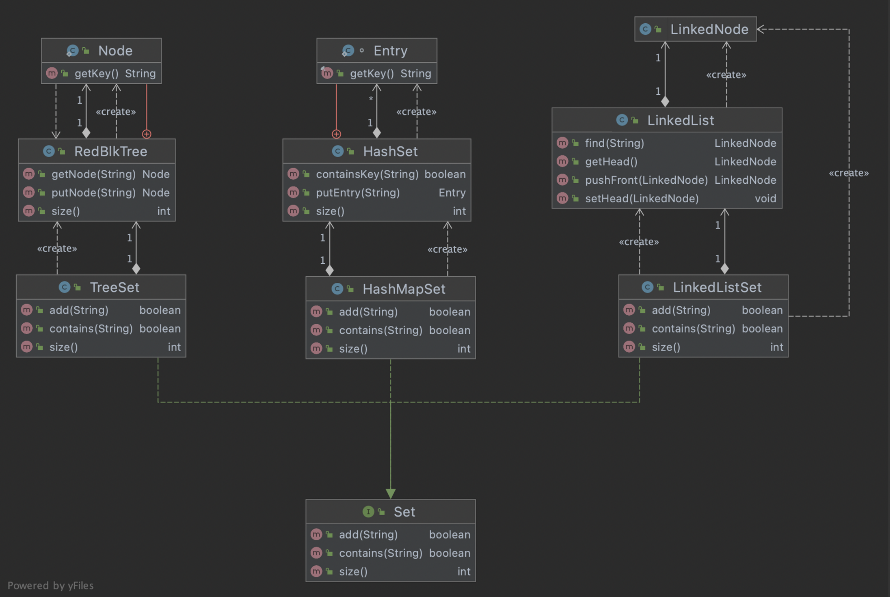

# SWE241P
Algorithm and Data Structure

## Ex1

- TreeSet with Red-Black Tree
- HashSet
- LinkedList Set

## Ex 2

- Selection Sort
- Insertion Sort
- Heap Sort
- Merge Sort
- Quick Sort

## Ex 3

Graph Representation

- Adjacency Matrix
- Adjacency List
- Incidence Matrix
- Conversion between each reprentation

## Ex 4

DFS and BFS on Graph
